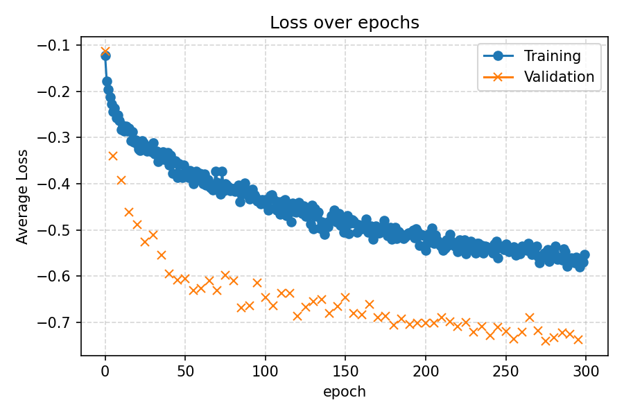

# UNet3D: Prostate 3D Data

This report will create 3D Image segmentation on Prostate in order to identify prostate cancer. 

| Segments                                 | True Values                      |
|------------------------------------------|----------------------------------|
|  |  |


## Getting Started
These instructions will get you a copy of the project up and running on your local machine. 

### Prerequisites
The things you need before installing the software.

conda:
  - numpy
  - tqdm
  - matplotlib
  - python=3.12
  - torchvision~~~~
  - pytorch-gpu
  - pytorch-cuda
  - scikit-learn
  - pandas-stubs=2.3.2.250926
  - pip:
    - kornia==0.8.1
    - nilearn==0.12.1
    - pip==25.2

All of these can be found in the environment.yml as well as some of their dependecies
### Installation

A step-by-step guide that will tell you how to get the development environment up and running.

```
# step 1: Create the enviroment
$ conda env create -f enviroment.yml

# step 2: Train the model
$ python3 train.py -i [Path to directory containing semantic_MRs and semantic_labels_only] -o [output directory] -e [epochs]

# step 3: Predict the outcomes
$ python3 predict.py -i [model.pth] -d [input data file] -o [output directory]
```
## How it works
This model trains on 128x128x128 segments of voxels It applied a series of transformations such as a 
Random Affine (p=0.7), Random Horizontal Flip (p=0.4) and Random Vertical Flip (p=0.4) the then trained an Improve UNet3d Model
as outlined in https://arxiv.org/abs/1802.10508v1. 300 epochs are then run taking 13 hours. 




### The final dice coefficients
Max Dice Coefficient: 0.7559  
Min Dice Coefficient: 0.7234

## Student Number
Cormac Flanagan: 48097655
